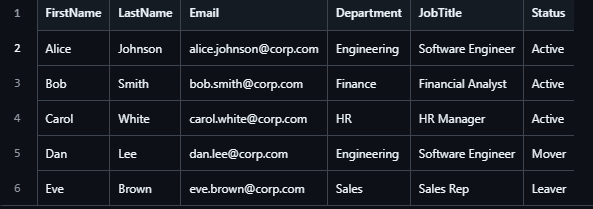
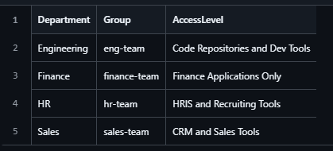
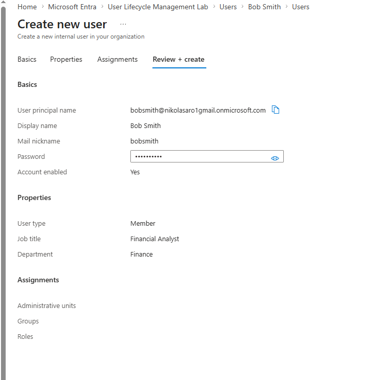
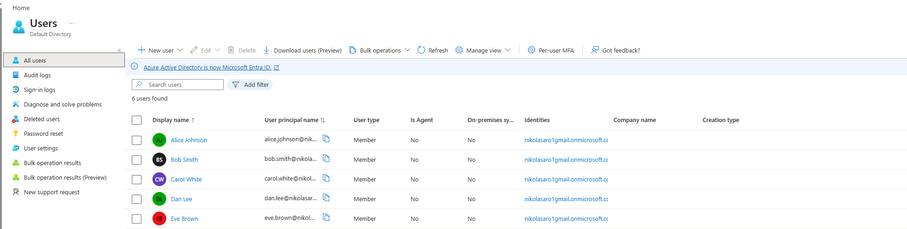

# Lab 01: User Lifecycle Management (Provisioning and Deprovisioning) 
## Objective
This lab focuses on managing the full user lifecycle in Microsoft Entra ID, including user and group creation, transferring users between departments, and deprovisioning accounts. 

The goal is to simulate real-world IAM operations such as joiner, mover, and leaver workflows while applying access control and least privilege principles throughout. This lab was conducted in a personal Microsoft Entra ID tenant using simulated users and groups to represent a company with multiple departments.

## Step 1: Create Roles and Users CSV
Created two CSV files to represent simulated company data. Roles CSV mapped each department, Users CSV includes user's name, department, job title, and status.

## Step 2: Create User Accounts
Click New User → Create New User → 
Fill in: 
- User principal name
- User display name
- User properties (User type, Job Title, Department)

Set or auto generate password

List of all created users

