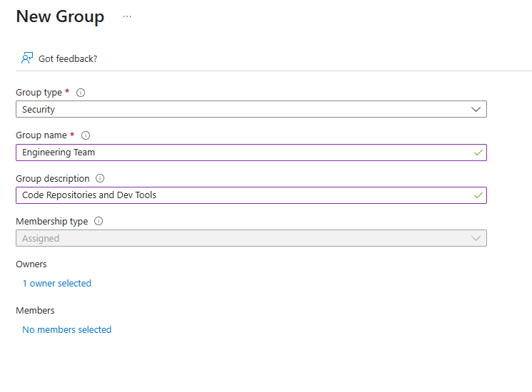
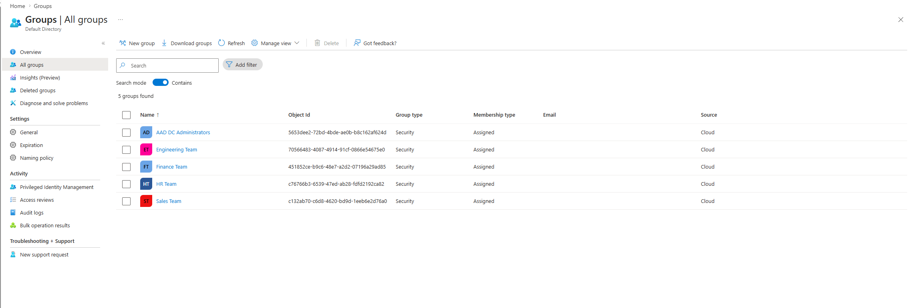
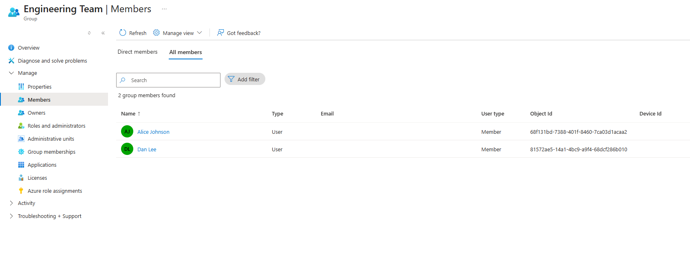
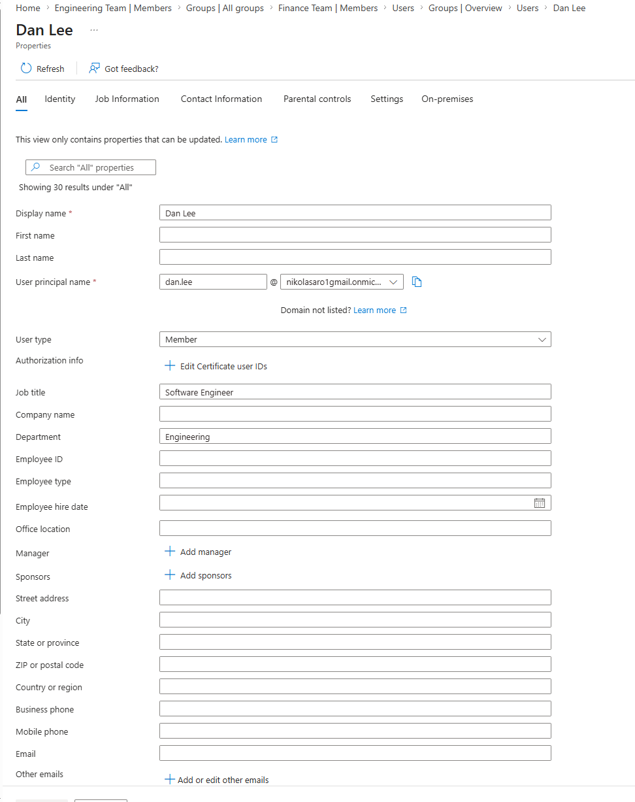
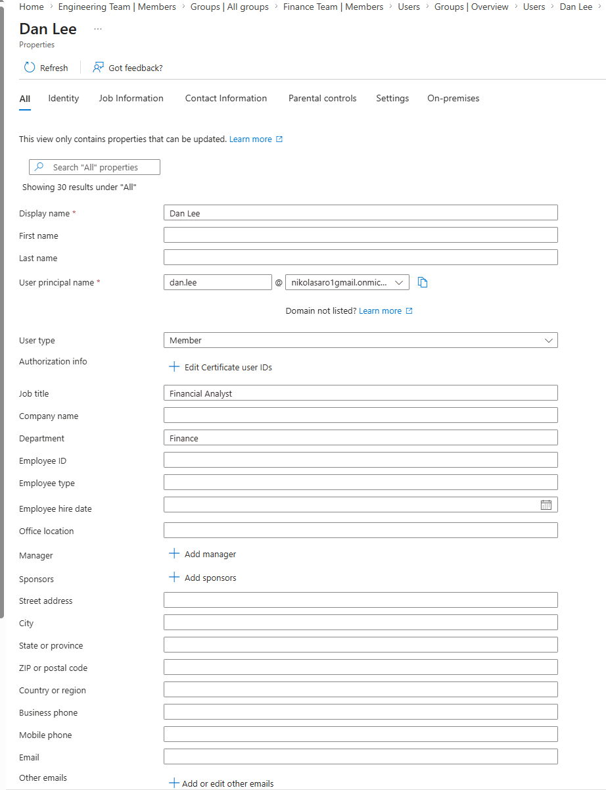
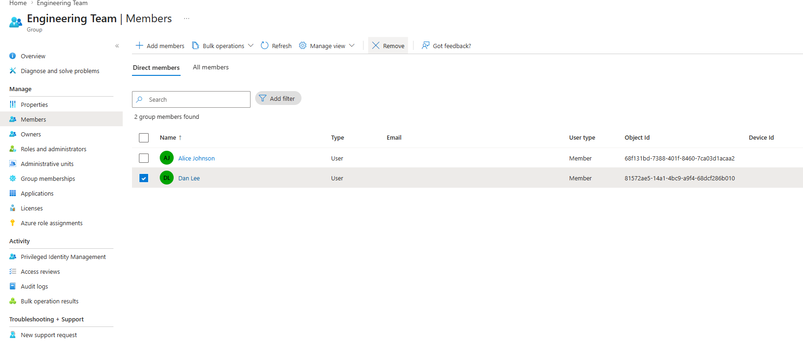
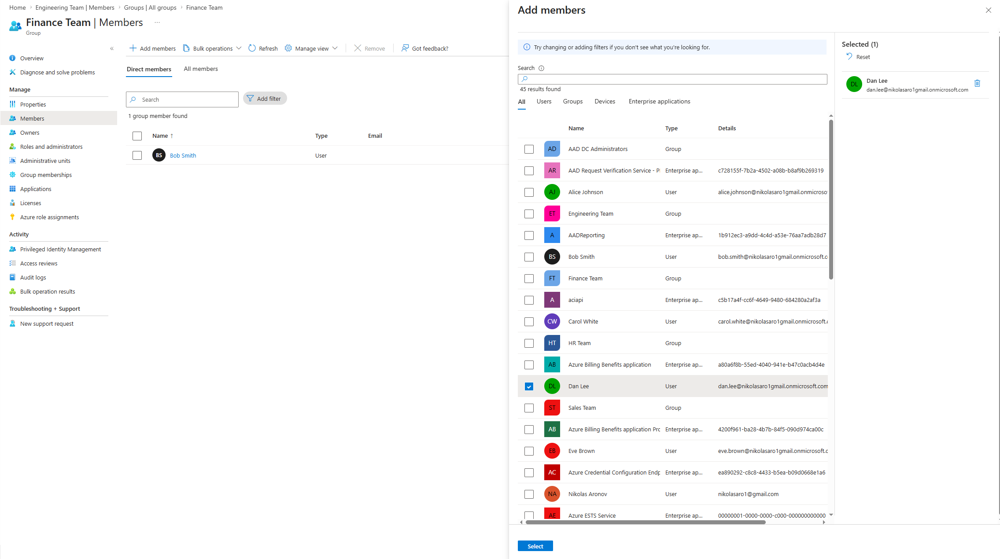
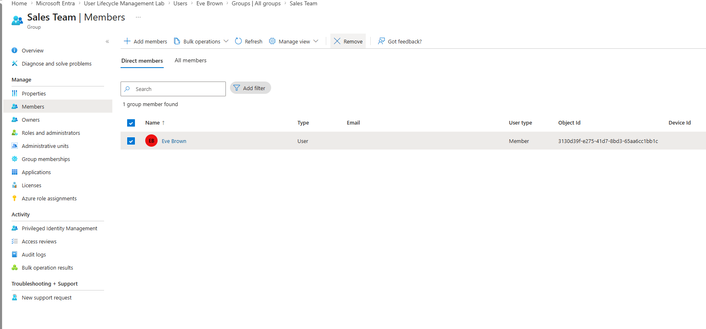
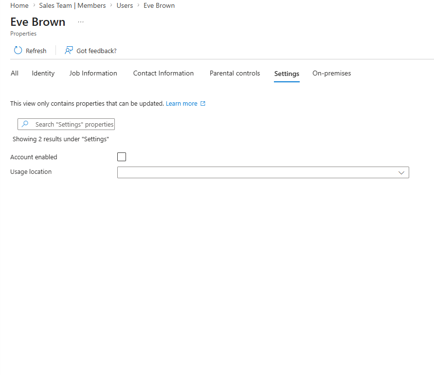
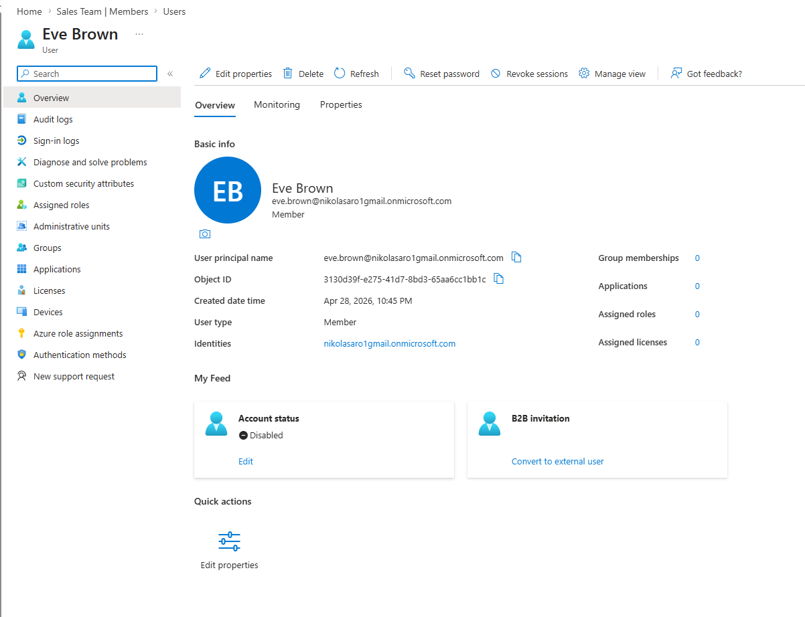

# Lab 01: User Lifecycle Management (Provisioning and Deprovisioning) 
## Objective
This lab focuses on managing the full user lifecycle in Microsoft Entra ID, including user and group creation, transferring users between departments, and deprovisioning accounts. 

The goal is to simulate real-world IAM operations such as joiner, mover, and leaver workflows while applying access control and least privilege principles throughout. This lab was conducted in a personal Microsoft Entra ID tenant using simulated users and groups to represent a company with multiple departments.

## Step 1: Create Roles and Users CSV
Created two CSV files to represent simulated company data. Roles CSV mapped each department, Users CSV includes user's name, department, job title, and status.

## Step 2: Create User Accounts
Click New User → Create New User → 
Fill in: 
- User principal name
- User display name
- User properties (User type, Job Title, Department)

Set or auto generate password

List of all created users:

## Step 3: Create Security Groups 
Click New Group 

Enter group name and description

Select:
- Group Type: Security
- Group Owners (My admin account)

List of all created groups:

## Step 4: Add user to groups
Click on All Groups → Choose specific group

Go to Members tab

Click Add Members

Select the appropriate user

# Part 2: User Changing Departments

## Step 1: Change Users Properties

Click on Users → Choose Appropriate User

Click Edit Properties → All

Change corresponding properties to appropriate department (Job Title, Department, etc)

  

## Step 2: Mover — Remove User From Original Department and Assign to New Department

Click Groups → All Groups → Choose Users Old Department Group

Click Members → Checkbox User → Remove

 

Click Groups → All Groups → Choose Users New Department Group

Click Members → Add Members → Choose Appropriate User

 

# Part 3: Leaver — Deprovision and Disable User Account

## Step 1: Remove User From Group Assigment

Click Groups → All Groups → Choose Users Assigned Group

Click Members → Checkbox User → Remove

 

## Step 2: Disable Users Account

Click on Users → Choose Appropriate User

Click edit on Account status

Uncheck the Account enabled box

  
  

# Part 4: Audit Log Review

Reviewed Audit Logs of both Users and Groups section to verify all changes made throughout all steps.

Audit Log Entries:

  <table>
  <tr>
    <td></td>
    <td></td>
  </tr>
</table>
     
Audit Log of Account being disabled showing AccountEnabled chaning from true to false:

## Conclusion
This lab simulated a real-world IAM workflow including user and group creation, department transfers, and account deprovisioning. Through the joiner, mover, and leaver process I gained hands-on experience managing user accounts, controlling group-based access, and applying least privilege principles. These skills directly reflect how identity and access management is handled in enterprise environments where controlling who has access to what is a core responsibility.
