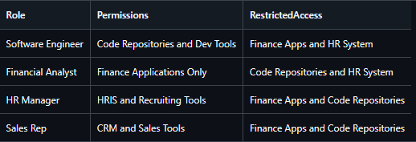
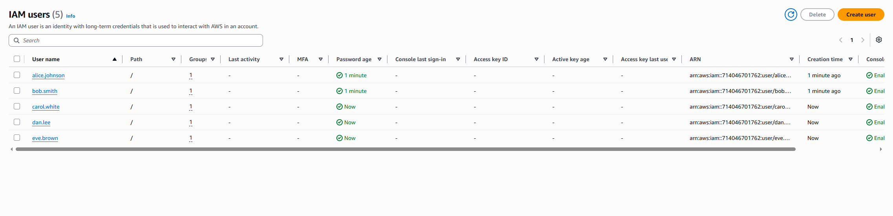
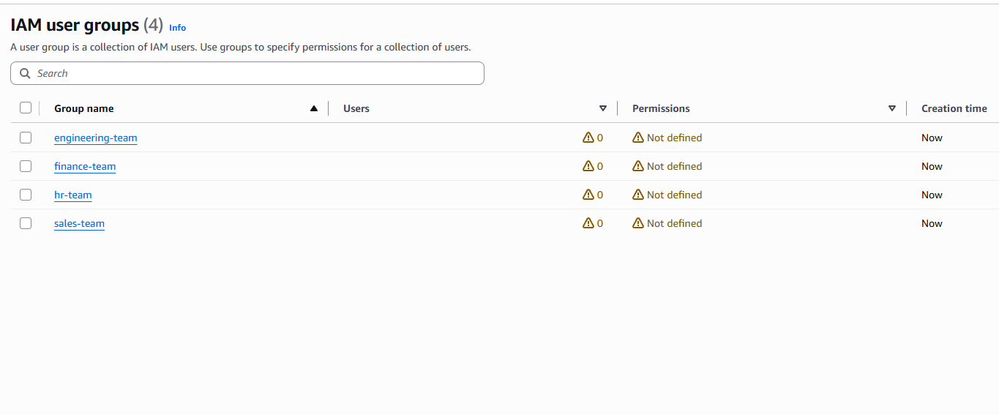
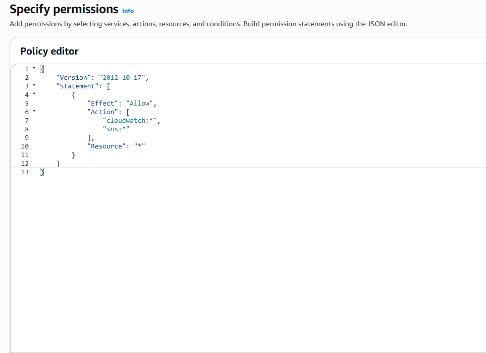

# Lab 01: Role Based Access Control Design
## Objective
This lab focuses on mapping job functions to permissions and eliminating excessive access. In this lab I define roles, assign permissions, test access boundaries and validate that users can only access what their role requires.

The goal is to simulate enterprise IAM work that reduces risks, simplifies audits and prevents over privileged accounts. This lab was made in a personal AWS IAM tenant using simulated users, groups and permissions to represent a company with multiple departments and roles.

## Step 1: Create Roles, Permissions and Access CSV
Created one CSV file that included multiple roles, permissions and the group access allowed for the permissions.

## Step 2: Create User Accounts and Groups
User: Click IAM Users → Create Users → 
Fill and Select: 
- User Name
- Checkmark Option: Provide user access to the AWS Management Console
- Set or auto generate password

List of Users Created: 

Group: Click IAM User Groups → Create Group → 
Fill in group name and click create

List of Groups Created: 

## Step 3: Create Working Test Policies and Permissions
Click Policy → Create Policy → Add JSON code

Created a custom JSON policy using AI based on department:

